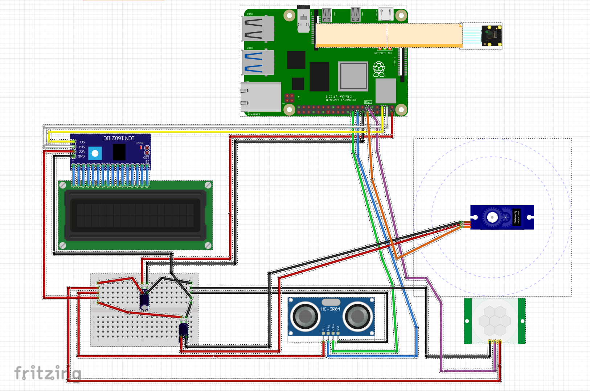

# VisionGate - Edge-Based Autonomous ALPR & Access Control System

VisionGate is an offline, edge-computing IoT perimeter security system developed on a Raspberry Pi 4 Model B (8GB). It replaces vulnerable radio frequency (RF) remotes and cloud-dependent cameras with on-device computer vision (YOLOv8 + OCR), hardware-level sensor safety interlocks, and an air-gapped TCP/IP control pipeline.

[](https://www.youtube.com/watch?v=p3h7gWHIDO8)

---

## Hardware & Edge AI Demonstration

Direct link to demonstration:  
[VisionGate Hardware Test Video](https://www.youtube.com/watch?v=p3h7gWHIDO8)

The demonstration highlights:
1. Real-time Edge ALPR: Dynamic triggering upon vehicle arrival, hardware ROI capture, YOLOv8 bounding box slicing, and Tesseract character recognition with Romanian county code validation.
2. Real-time Feedback: Synchronous alphanumeric LCD state changes (Detection -> CJ34RTY / ACCESS GRANTED).
3. Hardware Safety Interlock: SG90 barrier arm hold-open routine triggered by the HC-SR04 ultrasonic distance sensor when an obstacle is detected beneath the gate.
4. Desktop Monitoring: Live GUI log console reflection and instant audit capture playback.

---

## System Hardware Schematic

The prototype operates entirely locally on a breadboard setup powered by a stabilized 5V rail. Dual 1000uF decoupling capacitors suppress voltage ripple and protect logic sensors from transient current spikes generated during servo actuation.



### Hardware Interface Mapping
| Component | Device Pin | Raspberry Pi Pin | Function / Logic Level | Notes |
| :--- | :--- | :--- | :--- | :--- |
| HC-SR501 PIR | Output | GPIO 17 (Pin 11) | 3.3V Digital Input | Wake-on-Motion interrupt trigger |
| HC-SR04 Ultrasonic | Trig | GPIO 23 (Pin 16) | 3.3V Digital Output | Time-of-Flight safety ping |
| HC-SR04 Ultrasonic | Echo | GPIO 24 (Pin 18) | 3.3V Digital Input | Interlock echo return |
| TowerPro SG90 | PWM | GPIO 18 (Pin 12) | 50Hz PWM Output | Soft-sweeping barrier actuation |
| 16x2 LCD (PCF8574) | SDA / SCL | GPIO 2 / GPIO 3 | I2C Data / Clock | Address 0x27 for real-time feedback |
| Pi Camera V2 | CSI Ribbon | CSI Port | Direct Memory Interface | Zero-latency hardware CSI pipeline |
| Capacitors (x2) | +/- Rails | Breadboard 5V | 1000uF Power Buffer | Ripple reduction for servo load |

---

## Key Engineering & Architecture Highlights

* Hardware-Level Sensor Optimization: Configured the Sony IMX219 sensor via rpicam-still with a centered Region of Interest (--roi 0.5,0.2,0.5,0.5) and boosted sharpness (1.5). Hardware cropping at the sensor stage avoids CPU-heavy software downscaling.
* Dual-Stage Edge AI Pipeline:
  1. YOLOv8 Nano: Real-time license plate detection. Crops out the leftmost 12% of the bounding box to eliminate OCR confusion caused by the European blue band.
  2. Preprocessing: Grayscale conversion and CLAHE to restore character contrast under varying illumination.
  3. Tesseract OCR: Configured with --psm 8 and character whitelisting.
* Syntax Repair Engine: Custom deterministic parser validating against Romanian county codes with positional character repair (0 <-> O, 1 <-> I, 8 <-> B).
* Deterministic Safety Interlock: Prevents barrier collision by requiring 5 consecutive clear ultrasonic distance readings (>15 cm) and a 2-second stabilization delay before pulsing the servo closed.
* Concurrency & Logging: Asynchronous TCP sockets (port 5000) and SQLite Write-Ahead Logging (WAL) preventing database locks between AI threads, GUI dashboard, and mobile clients.

---

## Repository Structure

```text
├── docs/
│   └── hardware_schematic.png    # Fritzing circuit layout
├── actuators.py                  # SG90 PWM sweeping & ultrasonic closing interlock
├── app_gui.py                    # Multi-tab Tkinter desktop administration console
├── camera.py                     # CSI camera driver with hardware ROI & CLAHE
├── database.py                   # SQLite3 manager with WAL mode & RBAC schemas
├── image_processor.py            # YOLOv8 inference & blue-strip cropping logic
├── lcd_display.py                # I2C PCF8574 alphanumeric driver
├── main.py                       # Central orchestrator & multi-threaded command router
├── network_manager.py            # Automated nmcli hotspot lifecycle management
├── ocr_engine.py                 # Tesseract wrapper & Romanian syntax validator
├── sensors.py                    # HC-SR501 PIR debounce & HC-SR04 drivers
├── server_wifi.py                # Multi-client TCP socket server (port 5000)
├── requirements.txt              # Production Python dependencies
└── .gitignore                    # Excludes runtime DBs, IDE files, and captures
```

## Installation & Setup

Clone repository:
git clone https://github.com/Costinelos/VisionGate-Edge-ALPR.git
cd VisionGate-Edge-ALPR

Install dependencies:
pip install -r requirements.txt
sudo apt-get install -y tesseract-ocr

Execution:
# Run background AI & hardware pipeline
python main.py

# Run desktop management console
python app_gui.py
